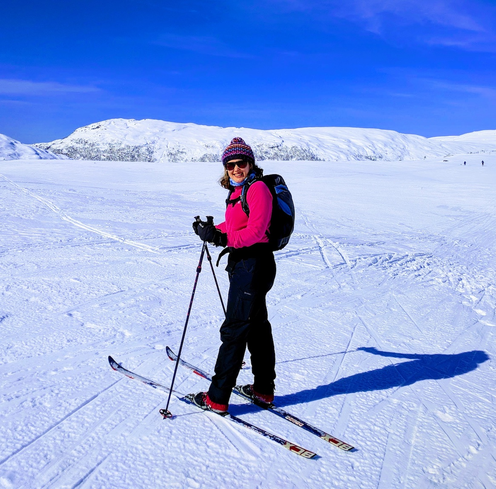

###Hello, I'm Line [liːnɛ]

I am very excited to embark on a new challenge in the tech industry. I have been self learning Python for twelve months, and currently I'm enrolled on HyperionDev's bootcamp in Software Engineering, backed by the Department for Education.

My goal in the next year is to work on challenging problems in a professional capacity and continue to learn at a rapid pace.

###🛠 &nbsp;Skills

- Python
- JavaScript
- HTML
- CSS
- Django
- SQL
- Bootstrap

#

📫 Follow me on [ LinkedIn](http://www.linkedin.com/in/linekjohnsen)
